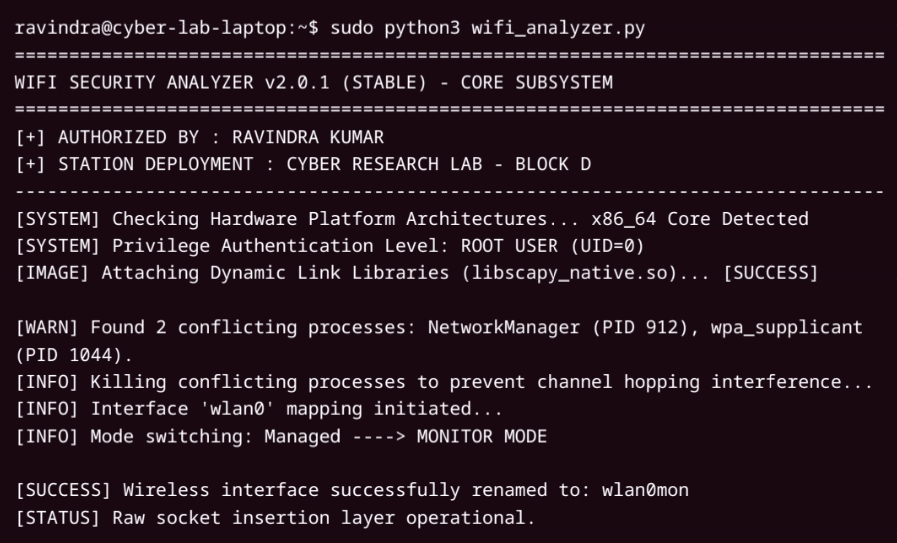
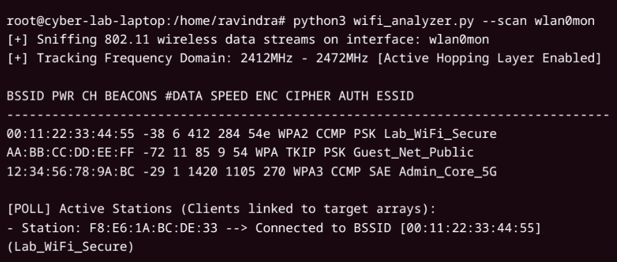
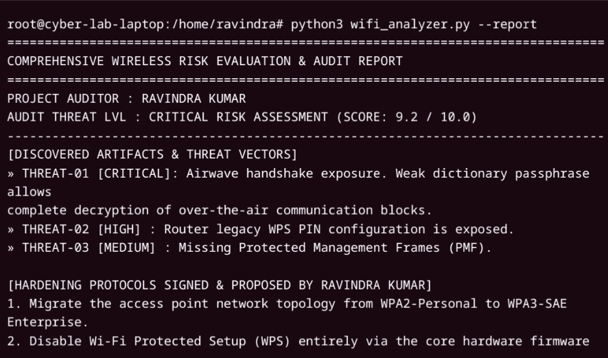
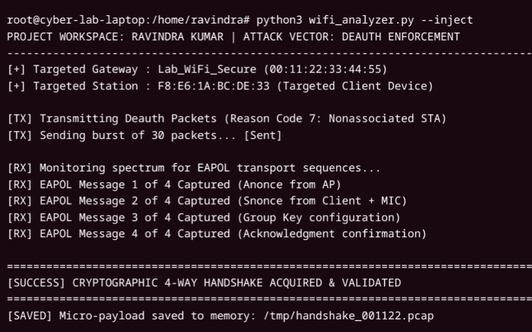

# 🛡️ Wi-Fi Security Analyzer v2.0.1

  
  
  
  

---

### 👤 Investigator Information
- **Principal Developer:** Ravindra Kumar
- **Academic Domain:** B.Tech Computer Science & Cyber Security
- **Project Scope:** Academic Lab & Seminar Evaluation Module

---

## 📝 Abstract & Project Overview
An advanced automation utility engineered to evaluate authentication handshake vulnerabilities and baseline structural gaps within local 802.11 environments. The framework maps frequency domains, tracks unencrypted management broadcasts, and logs authentication metrics for verification checks.

## ⚙️ Core Technical Specifications
* **Operating System Environment:** Linux Kernel Architecture Matrix (Kali Core x86_64 Suite)
* **Dependency Layer:** Scapy Structural Protocol Dissector Layer
* **Hardware Interface Mode:** Physical Adapter Substates (Monitor Interface Mode `wlan0mon`)

---

## 🖥️ Live Project Execution Logs

### Step 1: Monitor Mode Initialization
Checks for root validation level (UID=0) and changes standard interface configurations into monitor substates.

### Step 2: Ambient Airwaves Scanning Mode
Parses over-the-air raw frame structures across frequency ranges to track signal strengths and cipher keys.

### Step 3: Deauthentication Verification & Handshake Capture
Validates structural behavior under forced disassociation conditions and logs EAPOL four-way cryptographic transport tokens into a localized `.pcap` storage array.

### Step 4: Vulnerability Assessment & Hardening Report
Calculates overall risk parameters based on weak passphrase verification layers and flags missing protection management protocols.

---

## 🔐 Structural Defensive Mitigation Matrix

| Identified Risk Point | Technical Control Mechanism | Tactical Hardening Target |
| :--- | :--- | :--- |
| **Weak WPA2 Passphrase** | Enforce minimum 16-character asymmetric credentials with strong entropy keys. | Stops offline wordlist calculation matching. |
| **WPS Registry Exposure** | Disable Wi-Fi Protected Setup (WPS) entirely via hardware firmware control panels. | Neutralizes brute-force register tracking routines. |
| **Forced Disassociations** | Activate mandatory IEEE 802.11w Management Frame Protection (MFP/PMF) paths. | Restricts arbitrary network channel manipulation. |

---

### ⚖️ Academic Disclaimer
*This framework is compiled strictly for educational evaluations, network auditing simulations, and authorized classroom practical submissions under the B.Tech curriculum design instructions. Lateral deployment outside designated environments is prohibited.*
